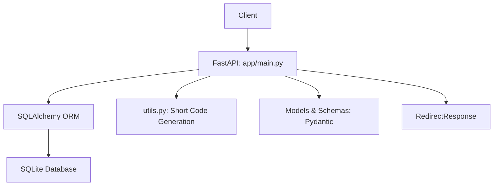

# URL Shortener

A scalable backend service that converts long URLs into short, shareable links — similar to Bitly.  
Built with **FastAPI**, **SQLite**, and **SQLAlchemy**, this project explores system design concepts such as hashing, database modeling, analytics, and scalability.

---

## Table of Contents
- [Quick Start](#quick-start)
- [Architecture](#architecture)
- [Features](#features)
- [API Usage](#api-usage)
- [Analytics](#analytics)
- [Design Deep Dive](#design-deep-dive)
- [Real-World Extensions](#real-world-extensions)
- [Testing & Quality Assurance](#testing--quality-assurance)
- [Contributing](#contributing)
- [License](#license)

---

## Quick Start

**Prerequisites:**
- Python 3.10+
- pip (Python package manager)
- Virtual environment (recommended)

**Setup:**
```bash
# Clone the repo
git clone https://github.com/<your-username>/url-shortener.git
cd url-shortener

# Create virtual environment
python3 -m venv venv
source venv/bin/activate   # Mac/Linux
venv\Scripts\activate      # Windows

# Install dependencies
pip install -r requirements.txt

# Run the app
uvicorn app.main:app --reload

# Access API Docs:
Swagger UI: http://127.0.0.1:8000/docs
ReDoc: http://127.0.0.1:8000/redoc
```

---

## Architecture


- **FastAPI:** RESTful API endpoints
- **SQLite:** Persistent storage for URL mappings + analytics
- **SQLAlchemy:** ORM for DB interactions
- **Pydantic Schemas:** Input/output validation
- **RedirectResponse:** Handles URL redirection

---

## Features
- Shorten long URLs into unique short codes
- Redirect short URLs to original destinations
- Track visit counts per link
- Analytics endpoints:
	- View stats for one short link
	- View all short links with stats
- Timestamps (created_at, expires_at)
- Extensible codebase for scaling (Redis caching, rate limiting, sharding)

---

## API Usage

### 1. Shorten a URL
```http
POST /shorten
```
```json
Body:
{
  "url": "https://apple.com/iphone17"
}

Response:
{
  "short_url": "http://127.0.0.1:8000/abc123"
}
```

---

### 2. Redirect to Original
```http
GET /abc123
```
→ Redirects to https://apple.com/iphone17

---

### 3. Get Analytics for One URL
```http
GET /analytics/abc123
```
```json
Response:
{
  "short_code": "abc123",
  "original_url": "https://apple.com/iphone17",
  "visit_count": 5,
  "created_at": "2025-09-22T18:05:00",
  "expires_at": null
}
```

---

### 4. Get All Analytics
```http
GET /analytics
```
```json
Response: [ {…}, {…}, {…} ]
```

## Analytics
- **Visit Counts:** Each redirect increments a counter
- **Created At:** Timestamp of link creation
- **Expires At:** Reserved field for link expiry (future extension)

---

## Design Deep Dive
- **Hashing & Code Generation:** Random alphanumeric short codes (6–8 chars).
- **Persistence:** SQLite (easily swapped for PostgreSQL, MySQL).
- **Scalability Considerations:**
	- Caching with Redis for fast lookups
	- Sharding DB by short code prefix
	- Load balancers for distributing traffic
- **Security Considerations:**
	- Input validation with Pydantic
	- Potential rate limiting to prevent abuse

---

## Real-World Extensions
- Custom aliases (`/my-link`)
- Expiration times (auto-invalid links)
- Batch URL shortening
- QR code generation
- Geo-location + User-Agent tracking
- Authentication (per-user analytics)
- Deployment via Docker + AWS/GCP

---

## Testing & Quality Assurance
- **Unit Tests:** Pytest for URL creation, redirects, analytics
- **Integration Tests:** End-to-end flows with a test DB
- **Load Testing:** Simulate high traffic with `locust` or Apache Benchmark

---

## Contributing
Solo learning project by Priya Sisodia.
Suggestions, forks, and pull requests are welcome!

---

## License
MIT License — free to use, modify, and distribute.

---